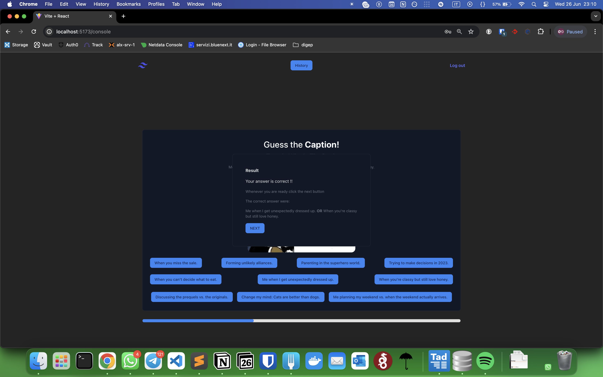

[](https://classroom.github.com/a/AVMm0VzU)
# Exam 28/06/24: "Meme game"
## Student: s331551 Bordino Luca 

## React Client Application Routes

- Route `/`: homepage, possibility to start game  or genereate background meme, 
- Route `/login`: login page, possibility to login with username and password
- Roiter `/logout`: logout no component, redirect to homepage
- Route `/history`: history page, protected, list of the played games and their generated memes
- Route `/console`: game page, possibility to play the game 1 round for  not logged in users, 3 rounds for logged in users


## Main React Components

- `Login` (in `Login.jsx`): component for login with username and password
- `Logout` (in `Logout.jsx`): fake component for logout
- `Console` (in `Console.jsx`): component with game UI
- `History` (in `History.jsx`): component with list of played games and their generated memes
- Header (in `Header.jsx`): component with the header of the pages

I've also creted a Logic component that is used to manage the game logic and the game state, it is used in the `Console` component, it is in `Logic.jsx`. This can be consider the middle layer between the UI and the API calls.
Those are organized in the request file that manage the Api calls and the interaction with the server, `request.js` file.


## API Server
### GET
- GET `/api/round`: get the info for the a round 
  - request parameters: first(round img id) , second (round img id)
  - response body content: 
  ```
    "imageId": 88888,
    "meme": "example...",
    "captions": [
        "When the boss isn't looking vs. when the boss turns around",
        "Choosing between work and nap time.",
        "Finding something unexpectedly everywhere.",
        "Me stopping myself from making a bad decision.",
        "Me escaping my responsibilities.",
        "Me arguing with myself.",
        "My reaction to life's little mishaps.",
        "When you're loyal to your favorite show but a new series catches your eye.",
        "Memes, memes everywhere.",
        "Facing the consequences of procrastination."
    ],
    "name": "X Everywhere"
  ```
  - Status code: if ok 200 Ok, else 500 Internal Server Error

- GET `/api/games`: get list of games
  - request parameters: none
  - response body content: 
  ```
    [
    {
        "userid": 4,
        "score": 0,
        "id": 44,
        "url": "https://i.imgflip.com/30b1gx.jpg",
        "correct": "0"
    },
    {
        "userid": 4,
        "score": 0,
        "id": 45,
        "url": "https://i.imgflip.com/23ls.jpg",
        "correct": "0"
    },
    ...
    ]
  ```
  - Status code: if ok 200 Ok, else 422 Unprocessable Entity


### POST
- POST `/api/game`: save game
  - body content: 
  ```
  {
  "score": 0,
  "rounds": [
    {
      "imageId": 1,
      "meme": "https://i.imgflip.com/30b1gx.jpg",
      "captions": [
        "Memes, memes everywhere.",
        "Me escaping my responsibilities.",
        "Responding to internet arguments.",
        "Trying to catch up with my goals.",
        "Change my mind: Cats are better than dogs.",
        "Finding something unexpectedly everywhere.",
        "When two unexpected things come together perfectly.",
        "When the boss isn't looking vs. when the boss turns around.",
        "When you and your friend realize you have different tastes.",
        "Me planning my weekend vs. when the weekend actually arrives."
      ],
      "answer1": "When the boss isn't looking vs. when the boss turns around.",
      "answer2": "Me planning my weekend vs. when the weekend actually arrives.",
      "name": "Drake Hotline Bling",
      "skipped": false,
      "correct": false
    },
    ...
    ]}
  ```
  - response body content: none
  - Status code: if ok 201 Created
- POST `/api/validate`: validate the answer
  - request body content
  ```
  {
    "roundId": 1,
    "answer": "When the boss isn't looking vs. when the boss turns around.",

  }
  ```
  - response body content:
  ```
  {
    "valid": true,
    "answer1": "When the boss isn't looking vs. when the boss turns around.",
    "answer2": "Me planning my weekend vs. when the weekend actually arrives."
  }
  ```
  - Status code: if ok 200 Ok, else 422 Unprocessable Entity
  
### AUTH API
- POST `/api/session`: login
  - request body content
  ```
  {
    "username": "user",
    "password": "password"
  }
  ```
  - response body content:
  ```
  {
    "id": 4,
    "username": "user",
    "password": "password"
  }
  ```
  - Status code: if ok 201 Created
- DELETE `/api/session`: logout
  - request body content: none
  - response body content: none

_ GET `/api/session`: get the current session
  - request parameters: none
  - response body content: 
  ```
  {
    "id": 4,
    "username": "user",
    "password": "password"
  }
  ```
  - Status code: if ok 200 Ok, else 401 Unauthorized

## Database Tables

- Table `users` - contains:
  - id: primary key
  - username: a unique username
  - password: a password
  - email: an email
  - salt: a salt for the password
- Table `games` - contains:
  - id: primary key
  - userid: a foreign key to the users table
  - score: the score of the game
  - url: the url of the meme
  - correct: the number of correct answers
- Table `memes` - contains:
  - id: primary key
  - url: the url of the meme
  - name: the name of the meme
  - answer1: the first answer
  - answer2: the second answer
- Table `caption` - contains:
  - caption: text the caption of the meme

## Screenshots





## Users Credentials

- albert.einstein@relativity.org, testtest
- guido.vanrossum@python.org,  testtest
